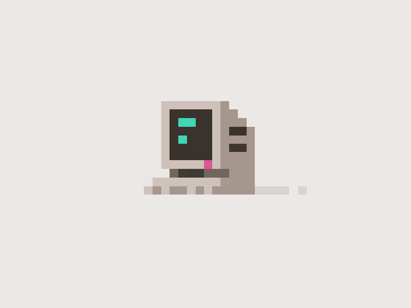

# 💻 Computador em Pixel Art com CSS  

Este projeto é um pequeno experimento de **pixel art feito 100% com CSS e HTML**, sem o uso de imagens externas (exceto a prévia aqui no README!).  

## 🎨 Sobre o projeto  
A proposta foi criar um computador estilo retrô, blocado pixel a pixel, utilizando `divs` em um grid CSS. Além de divertido, é um ótimo exercício de criatividade e prática de organização no código.  

## 📸 Preview  
  

## 🚀 Tecnologias usadas  
- HTML5  
- CSS3  

## 💡 Como rodar o projeto  
1. Clone o repositório:  
```bash  
git clone https://github.com/seu-usuario/seu-repositorio.git  
```  
2. Abra o arquivo `index.html` no seu navegador favorito.  

## ✏️ Autor  
Feito por [Lis Marreiros](https://github.com/lismarreiros) — inspirado pelo minimalismo da arte em 8-bits!
